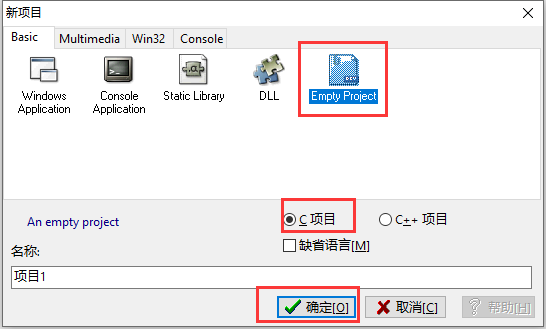

# 1.1环境配置

## 1.下载 Dev C++


推荐使用 Dev C++ 作为编译环境  
除非你是**C语言方面的专家**或者**非常喜欢Windows98**的界面,否则**不推荐**使用**20多年前**发布的VC++6.0 \(点击[这里](http://ladder1984.github.io/post/%E7%8F%8D%E7%88%B1%E7%94%9F%E5%91%BD%E8%BF%9C%E7%A6%BBvc6/)查看[为什么?](http://ladder1984.github.io/post/%E7%8F%8D%E7%88%B1%E7%94%9F%E5%91%BD%E8%BF%9C%E7%A6%BBvc6/)\)


点击[这里](https://sourceforge.net/projects/orwelldevcpp/)下载Dev C++  
或者百度网盘：[https://pan.baidu.com/s/1mhHDjO8](https://pan.baidu.com/s/1mhHDjO8)    提取密码：mken

在中国大陆可能无法访问SourceForge

## 2.安装 Dev C++

